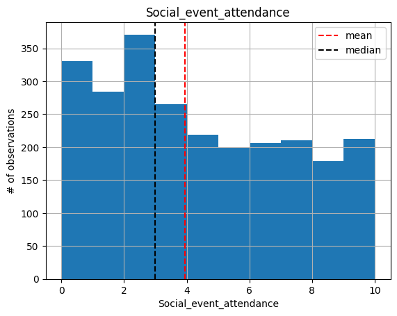
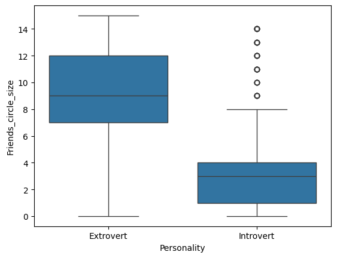
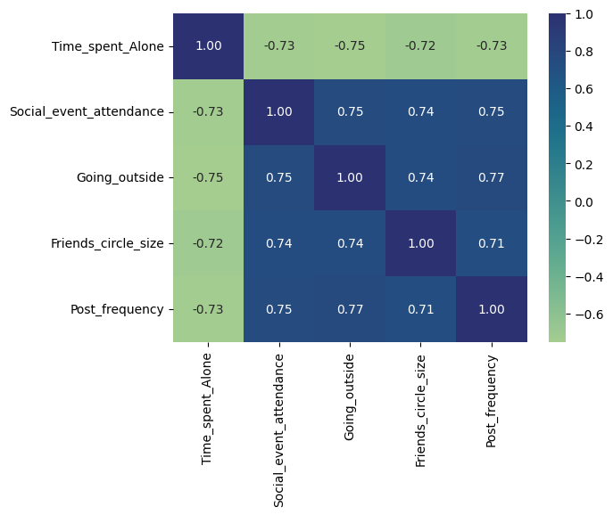

# Personality-ml-classifier
## Overview
* Create a machine learning model that based on behavioral data can be used to identify if someone is extorvert or introvert
* The data was downloaded from kaggle
* Use a Logistic Regression model to build the classifier

## Code and Tools
**Pyhton version:** 3.13  
**Environment:** VS Code  
**Packages:** Pandas, numpy, matplotlib, seaborn and scikitlearn.  

## Dataset Information
**Name:** [Extrovert vs Introvert Behavior Data](https://www.kaggle.com/datasets/rakeshkapilavai/extrovert-vs-introvert-behavior-data?select=personality_dataset.csv)  
**Source:** Kaggle  
**Features:**
1. **Time_spent_Alone**: Hours spent alone daily  
2. **Stage_fear**: Presence of stage fright
3. **Social_event_attendance**: Frequency of social events
4. **Going_outside**: Frequency of going outside
5. **Drained_after_socializing**: Feeling drained after socializing
6. **Friends_circle_size**: Number of close friends
7. **Post_frequency**: Social media post frequency
8. **Personality**: Target variable (Extrovert/Introvert)

## **Process**
1. EDA and data cleaning
2. Preprocessing
3. Data Modeling
4. Model and Evaluation

### 1. EDA and Data Cleaning 
#### Data Cleaning
This data was very present 2 problmes. The first one is that it have missing values and the second one some of the features had in the incorrect data type.

1. **Missing values:** After identifying the missing values, I set a threshold of 5% based on the total length of the DataFrame. Then, I dropped the missing values from all columns that contained 5% or less missing data. No further action was needed, as all missing values were removed
2. **Data types:** The numeric data types were transformed to integers

#### EDA
For the numeric data firts I create some histograms to visualize the distribution and also calculate the correlation for this vairbales. The categorical data was analyzed by creating contingency tables to identify the relationships between the target variable and the rest of categorical variables. Also use some boxplots to identify relationships between the target variable and the numerical variables.

    

### Preprocessing

### Model Building 

### Model Performance

+ **Accuracy:** 0.93
+ **F1-score:** 0.94
